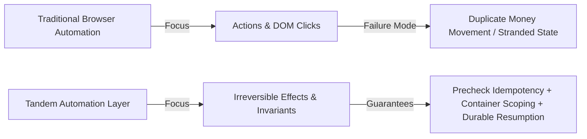
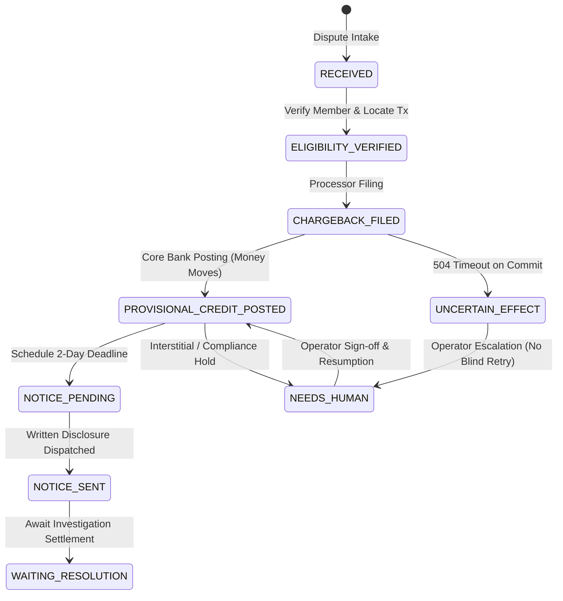

# Tandem System Architecture

This document details the architectural principles, distributed-systems primitives, and safety protocols governing Tandem: an effect-aware computer-use automation layer designed for legacy financial workflows under **Regulation E (12 CFR 1005.11)**.

---

## 1. Executive Summary & Design Principles

Traditional web automation frameworks (Playwright, Selenium, Puppeteer) and computer-use agent frameworks (Browser-Use, Agent-E) operate at the level of **actuations**: clicking CSS selectors, filling forms, and awaiting network idle states. 

In financial operations spanning non-API legacy systems, equating successful DOM clicks with business task completion causes catastrophic failures:
- **"The money moved. The procedure didn't finish."**
- A crash after a fund mutation leaves the procedure stranded.
- A naive retry posts duplicate funds.
- A confusable account number credits the wrong member.
- A 504 Gateway Timeout triggers a blind retry that submits double chargebacks.

Tandem replaces click-oriented automation with **Effect-Aware Computer-Use**:



### Four Foundational Architectural Invariants
1. **The Zero-LLM Production Invariant:** LLMs are strictly confined to exploratory discovery. Once an interaction trace is compiled and validated into a versioned YAML capability with a SHA-256 integrity hash, production replay executes deterministically with `llm_call_count == 0` asserted in tests.
2. **Container-Scoped Identity & Amount Guards:** DOM-wide substring checks are strictly rejected. Before any submit action is dispatched, Tandem evaluates the immediate enclosing container of the submit button, verifying exact member ID and dollar balance to prevent misdirected funds on confusable accounts.
3. **Precheck-Driven Idempotency:** Every capability classified as `COMMIT` requires a precheck inquiry. If the effect already exists in the target system, execution halts immediately with `ALREADY_APPLIED` without actuating any UI controls.
4. **No Blind Retries on Ambiguous State:** When network partitions or 504 timeouts occur during a commit, Tandem executes postcheck reconciliation. If inconclusive, it escalates to `UNCERTAIN_EFFECT` and routes to human oversight.

---

## 2. The 14-Step Effect-Aware Commit Protocol

Every irreversible operation (`COMMIT`) executed by `tandem.replay.engine.EffectEngine` enforces a 14-step safety lifecycle:

```mermaid
sequenceDiagram
    autonumber
    participant Caller as Orchestrator
    participant Engine as EffectEngine
    participant Policy as Bound & Guard Policy
    participant Ledger as SQLite WAL Ledger
    participant Surface as PlaywrightSurface
    participant Target as Legacy Core / Processor

    Caller->>Engine: execute_capability(cap, inputs)
    Engine->>Engine: Formulate Idempotency Key (regE:{case_id}:credit)
    Engine->>Target: Execute Precheck Inquiry
    alt Effect Already Present
        Target-->>Engine: Found existing memo reference
        Engine-->>Caller: ALREADY_APPLIED (Touches nothing; 0 duplicate credit)
    else Effect Not Present
        Engine->>Policy: Validate Monetary Bounds (amount <= $500.00)
        Policy-->>Engine: Bounds Validated
        Engine->>Ledger: Stage Effect Intent (STAGED)
        Engine->>Ledger: Acquire Single-Owner Lease (AUTOMATION)
        Engine->>Surface: Observe Container (#credit_action_container)
        Surface->>Policy: Verify Scoped Member ID & Amount
        alt Entity Binding Mismatch
            Policy-->>Engine: Reject (ENTITY_BINDING_MISMATCH)
            Engine->>Ledger: Record HARD_FAILURE
            Engine-->>Caller: Halt (0 funds moved)
        else Entity Binding Verified
            Engine->>Surface: Actuate Commit Submit Control
            Surface->>Target: Submit HTTP POST / Form
            alt Browser Crash or 504 Timeout
                Target--xEngine: 504 Gateway Timeout / Dropped Connection
                Engine->>Target: Postcheck Reconciliation Inquiry
                alt Reconciled via Inquiry
                    Target-->>Engine: Transaction Confirmed
                    Engine->>Ledger: Record EFFECT_RECONCILED
                    Engine-->>Caller: Advance Procedure
                else Inconclusive
                    Engine->>Ledger: Record UNCERTAIN_EFFECT & Alert
                    Engine-->>Caller: Escalate to Human Queue (No Blind Retry)
                end
            else Normal Execution
                Target-->>Surface: Receipt Page Rendered
                Surface->>Engine: Extract Memo Code & Money Moved Confirmation
                Engine->>Ledger: Commit SUCCESS & Resolve Deadlines
                Engine-->>Caller: Return COMPLETED
            end
        end
    end
```

---

## 3. Append-Only Procedure Ledger & Write-Ahead Logging (WAL)

Tandem relies on an append-only relational ledger implemented in SQLite. It does not maintain transient in-memory state machines for workflow progression.

### Database Schema & Relationship Topology
- `procedure_cases`: Stores core dispute metadata, disputed amount, current state machine status, and money movement flag.
- `procedure_events`: Append-only chronological audit log of all events (`DISPUTE_INITIALIZED`, `STEP_STARTED`, `EFFECT_COMMITTED`, `HUMAN_HANDOFF_INITIATED`, `PROCESS_KILLED`).
- `capability_executions`: Records every discrete capability run, inputs, actor (`AUTOMATION` vs `HUMAN`), start time, completion time, observed memo references, and failure categories.
- `effect_intents`: Tracks staged intents before submission to detect orphaned transitions.
- `statutory_deadlines`: Tracks 12 CFR 1005.11 compliance deadlines with timestamps and resolution status (`PENDING` vs `MET`).
- `leases`: Manages mutual-exclusion execution leases (`AUTOMATION` vs human operator IDs).

### WAL Concurrency & Crash Invariants
The SQLite engine is configured via connection listeners:
```sql
PRAGMA journal_mode = WAL;
PRAGMA synchronous = NORMAL;
PRAGMA foreign_keys = ON;
PRAGMA busy_timeout = 30000;
```
When a process is terminated violently (e.g. `kill -9` or Windows `TerminateProcess`) immediately after provisional credit is posted, the operating system kernel and filesystem guarantee that WAL commits remain durable.

Upon reboot:
1. `LedgerService.reconstruct_case_state(case_id)` queries the database.
2. It aggregates completed capability execution records and observed memo codes.
3. It determines `money_moved = True`.
4. It detects that `core.post_provisional_credit` succeeded, but `docs.send_notice` remains pending.
5. The orchestrator resumes at Step 6, dispatching the disclosure notice without re-running provisional credit.

---

## 4. Container-Scoped Identity & Monetary Guards

A standard vulnerability in financial web automation is the **page-level text assertion**:
```python
# VULNERABLE CODE (Do NOT use)
assert "8830142" in page.content()
page.click("button.btn-commit")
```
When legacy banking core search results return fuzzy hits, the page frequently contains both target member `8830142` (balance $1,240.50) and confusable member `8830124` (balance $410.25). A page-level check passes regardless of which account row was activated.

### Container-Scoped Guard Implementation
Tandem resolves this by scoping verification to the immediate DOM container enclosing the submit control:
```python
# TANDEM SCOPED GUARD
container_loc = surface.observe_container(
    container_selector="#credit_action_container, .confirm-panel"
)
observed_text = container_loc.text_content()

# Verify exact token containment inside the localized container
if expected_member not in observed_text:
    raise EntityBindingMismatchError(
        f"Control-scoped guard failed: expected member '{expected_member}' "
        f"but observed '{observed_text}' inside container"
    )
```
If an operator or fuzzy search selected `8830124`, the container guard intercepts the discrepancy before the click is dispatched, preventing misdirected funds.

---

## 5. Surface Abstraction Layer & Institution Overlays

To decouple business capabilities from vendor-specific CSS selectors and DOM structure, Tandem introduces the `Surface` abstraction and `SurfaceOverlay`:

```
Capability (Semantic Target) ──> SurfaceOverlay (Vendor Override) ──> PlaywrightSurface ──> DOM
```

### Semantic Targets vs Vendor Selectors
In `capabilities/core/post_provisional_credit.yaml`:
```yaml
steps:
  - step_id: "step_fill_search"
    action: "FILL"
    semantic_target: "Member Search Input"
    locator_candidates:
      - "input[name='q']"
      - "#search_input"
    frame_selector: "#core_workspace_frame"

  - step_id: "step_click_commit"
    action: "CLICK"
    semantic_target: "Commit Button"
    locator_candidates:
      - ".btn-commit-final"
      - "button[type='submit']"
```

### Multi-Institution Surface Overlays
When deploying across distinct institutions (e.g. Institution Alpha running modern Keystone vs Institution Beta running older Symitar skins):
```python
OVERLAYS = {
    "core_bank_beta": SurfaceOverlay(
        institution_id="core_bank_beta",
        name="Symitar Legacy Platform (Older Skin / Second Institution)",
        selector_overrides={
            "Member Search Input": ["#legacy_search_box", "input[name='q']"],
            "Post Provisional Credit Link": [".btn-action-legacy", "a.action-credit-btn", "text=Select & Adjust"],
            "Commit Button": [".btn-commit-legacy", ".btn-commit-final", "button[type='submit']"],
        },
        container_overrides={
            "#credit_action_container, .confirm-panel": ".legacy-confirm-box",
        },
    ),
}
```
If an element drifts, Tandem logs the rank discrepancy (`PageDriftEvent`). If unmapped, it halts safely without attempting hallucinated clicks.

---

## 6. Single-Owner Lease Protocol for Human Handoff

In financial operations, human operators and automated bots must never manipulate the same account record concurrently.

Tandem enforces mutual exclusion via the `HandoffCoordinator`:
1. **Automation Relinquishment:** Upon encountering a compliance interstitial, automation releases its lease in the SQLite database and transitions to `NEEDS_HUMAN`.
2. **Mutual Exclusion Lock:** Only one human operator can hold the lease for a given case. If `operator_bob` attempts to claim a case held by `operator_sarah`, Tandem raises `LeaseConflictError` (HTTP 409 Conflict).
3. **Active Session Action:** The operator accesses the live browser session, reviews the compliance alert, and acknowledges the sign-off button.
4. **Safe Automation Resumption:** The operator releases the lease back to `AUTOMATION`. The orchestrator resumes execution from the exact point of suspension.

---

## 7. Ambiguity Classification & Postcheck Reconciliation

When an HTTP POST or DOM submit action drops connection (e.g. 504 Gateway Timeout on card processor submission):
- **Naive Automation:** Assumes failure, retries the submission, and creates duplicate chargeback filings.
- **Tandem Protocol:** Classifies the error as **ambiguous**. It queries the processor's postcheck inquiry endpoint (`/api/chargebacks/{case_id}`).
  - **Case A (Confirmed):** The record exists. Tandem marks `EFFECT_RECONCILED` and advances without re-submitting.
  - **Case B (Inconclusive):** The record is missing or the endpoint is unreachable. Tandem records `UNCERTAIN_EFFECT`, raises an alert, yields the lease, and halts for human investigation. **Blind retries are strictly forbidden.**

---

## 8. Regulation E (12 CFR 1005.11) State Machine



### Statutory Deadlines Enforced:
- **`NOTICE_2_DAY`:** 2 business days after provisional credit is posted (12 CFR 1005.11(c)(2)(ii)).
- **`INVESTIGATION_10_DAY`:** 10 business days to complete investigation or post provisional credit (12 CFR 1005.11(c)(1)).
- **`FINAL_RESOLUTION_45_DAY`:** 45 calendar days to resolve dispute (12 CFR 1005.11(c)(2)).

---

## 9. Comparative Architecture Evaluation

| Architectural Dimension | Naive Browser-Use / Agentic Replay | Traditional RPA (UiPath, Automation Anywhere) | Temporal / Cadence Orchestrator | Tandem Automation Layer |
|---|---|---|---|---|
| **Replay Invariant** | LLM predicts next click at runtime | Hardcoded desktop coordinates | Workflow code execution | **Zero-LLM deterministic Playwright replay** |
| **Idempotency** | None (retries blind clicks) | Scripted database check (if custom-built) | Activity idempotency keys (API-only) | **Precheck inquiry + memo code verification** |
| **Entity Safety** | Page-level prompt evaluation | Visual optical character recognition | Relies on backend API validations | **Container-scoped member & balance guard** |
| **Crash Durability** | Lost on browser process death | Script aborts; requires manual cleanup | Workflow event replay across workers | **SQLite WAL ledger with durable state reconstruction** |
| **Ambiguity Handling**| Hallucinates next step or repeats | Unhandled script exception | Exponential backoff retry (dangerous for UI) | **Postcheck reconciliation -> `UNCERTAIN_EFFECT`** |
| **Operator Handoff** | None (unattended agent fails) | Operator takes mouse control | Human tasks via external task queue | **Single-owner mutual-exclusion lease on live session** |
| **Regulation Compliance**| Unaware | Unaware | Generic cron | **Built-in 12 CFR 1005.11 statutory business-day calculator** |
