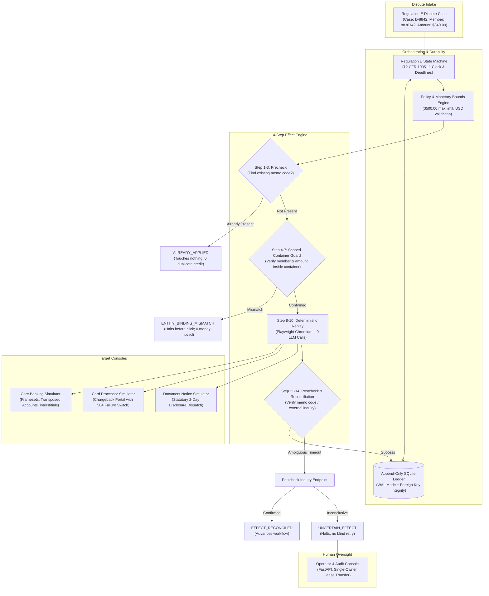

# Tandem

> **Effect-aware computer-use automation layer for legacy financial systems.**
> Bridges conversational dispute intake with disconnected core banking platforms, card processors, and notice engines under Regulation E (12 CFR 1005.11).

[](https://github.com/tandem-org/tandem/actions/workflows/ci.yml)
[](https://www.python.org/downloads/release/python-3120/)
[](https://playwright.dev/)
[](https://www.sqlite.org/wal.html)
[]()

---

## 1. The Core Problem

At hundreds of US community banks and credit unions, modern conversational AI voice and chat bots take in customer card disputes. But executing those disputes requires logging into and manipulating four disconnected vendor systems:
1. **Core Banking System** (e.g. legacy Symitar / Keystone running on iframes, tables, dynamic IDs, and 3270-style terminal emulators)
2. **Card Network Processor Portal** (e.g. Visa DPS / MasterCard chargeback settlement portals)
3. **Document / Notice Dispatch Engine** (e.g. batch letter generators for compliance disclosures)
4. **Internal Dispute Case Tracker** (e.g. spreadsheets or legacy ticketing)

None of these legacy systems expose bidirectional APIs to each other. When autonomous computer-use agents drive browser sessions across these applications, the central distributed-systems hazard is:

$$\text{\bf "The money moved. The procedure didn't finish."}$$

A browser automation may navigate the core banking console and post **$340.00** in provisional credit, then crash or suffer a network timeout before filing the chargeback or generating the mandatory 2-business-day written notice.

### The Catastrophic Costs of Naive Computer-Use Automation
- **Duplicate Provisional Credit:** Blindly restarting from step 1 re-posts credit, paying member funds twice.
- **Misdirected Funds on Confusable Entities:** Searching member `8830142` returns fuzzy hits including `8830124`. Selecting the wrong row credits the wrong account.
- **Compliance Penalties under 12 CFR 1005.11:** Regulation E mandates strict statutory deadlines:
  - **2 Business Days:** Written disclosure of provisional credit to consumer.
  - **10 Business Days:** Provision of provisional credit if investigation cannot conclude immediately.
  - **45 Calendar Days:** Maximum statutory investigation period.
- **Unsafe Retries on Ambiguous State:** A 504 Gateway Timeout on a commit submission cannot be retried without determining if the mutation landed.

---

## 2. Tandem's Architectural Solution

Tandem ensures that when browser automation acts upon financial systems, execution guarantees **effects**, not merely DOM clicks.



---

## 3. Core Architectural Invariants

### 1. Strict Zero-LLM Production Replay (`llm_call_count == 0`)
LLMs are utilized strictly for **exploratory discovery** and offline capability compilation. Once an interaction sequence is synthesized and validated into a versioned YAML capability with a SHA-256 integrity hash, production execution executes deterministically with Playwright. Every replay test asserts `llm_tracker.call_count == 0`.

### 2. The 14-Step Effect-Aware Commit Protocol
Irreversible actions (`COMMIT`) must execute the strict lifecycle:
1. **Idempotency Key Formulation:** `regE:{case_id}:provisional_credit`
2. **Precheck Inquiry:** Queries target system before actuating UI controls.
3. **Short-Circuit on Existing Effect:** If verified, returns `ALREADY_APPLIED` immediately.
4. **Monetary Bounds Validation:** Verifies amount $\le \$500.00$ limit.
5. **Container-Scoped Identity Guard:** Evaluates the immediate ancestor DOM container (e.g. `#credit_action_container`) of the submit button, verifying exact member ID and dollar balance. If fuzzy search returned the wrong row (`8830124` vs `8830142`), halts with `ENTITY_BINDING_MISMATCH`.
6. **Execution Intent Staging:** Records staged intent in the SQLite ledger.
7. **Single-Owner Lease Acquisition:** Prevents concurrent browser sessions on the same case.
8. **UI Actuation:** Dispatches click event through surface abstraction.
9. **Postcheck Verification:** Evaluates receipt container and extracts unique memo code (e.g. `MC-7621`).
10. **Reconciliation on Ambiguity:** If 504 Gateway Timeout occurs, executes postcheck inquiry. If unconfirmed, transitions to `UNCERTAIN_EFFECT` and routes to human operator without blind retry.

### 3. Append-Only Procedure Ledger with Write-Ahead Logging (WAL)
Every case initialization, capability execution, monetary state, and statutory deadline is durably committed to SQLite configured with `PRAGMA journal_mode=WAL`, `synchronous=NORMAL`, and `busy_timeout=30000`. If the process is terminated via `SIGKILL` after provisional credit posts, state is reconstructed from the ledger on restart, skipping duplicate credit and completing pending notices.

### 4. Single-Owner Lease Human Handoff
When compliance interstitials (e.g. BSA/AML holds) appear, automation yields its lease and transitions to `NEEDS_HUMAN`. An operator claims the lease, reviews the live browser session, signs off, and yields the lease back to automation to conclude the workflow.

---

## 4. Repository Structure

```
Tandem/
├── capabilities/                  # Versioned capability definitions & compiler output
│   ├── compiled/                  # Artifacts generated by DiscoveryAgent (SHA-256 hashed)
│   └── core/                      # Standard production capabilities (YAML)
├── docs/                          # Architectural specs & technical defenses
│   ├── architecture-research.md   # Ecosystem comparative research & trade-offs
│   ├── interviewer-questions.md   # Anticipated questions, tradeoffs, justifications
│   └── product-spec.md            # Problem extraction and 8 specification scenarios
├── scripts/                       # Runnable demonstration scripts and utilities
│   ├── demo.py                    # Interactive CLI runner for all 8 scenarios
│   ├── seed.py                    # Idempotent state initializer for banking simulators
│   └── start_services.py          # Unified multi-process launcher (ports 8000, 8001, 8003, 8004)
├── simulators/                    # Hostile legacy simulator applications
│   ├── core_bank/                 # Hostile Core Banking (iframes, dynamic IDs, skins)
│   ├── documents/                 # Regulation E disclosure notice dispatch portal
│   └── processor/                 # Card network chargeback portal (504 failure switches)
├── tandem/                        # Core Tandem automation library
│   ├── api/                       # Operator & Audit Console (FastAPI web app)
│   ├── discovery/                 # DiscoveryAgent, TraceRecorder, CapabilityCompiler
│   ├── domain/                    # Effect classes, Capability schemas, Outcome taxonomy
│   ├── handoff/                   # HandoffCoordinator & single-owner lease management
│   ├── ledger/                    # SQLite WAL ledger, models, repository, service
│   ├── policy/                    # Monetary bounds, scoped guards, LLM call telemetry
│   ├── replay/                    # DeterministicExecutor, EffectEngine, reconciliation
│   ├── surfaces/                  # Surface abstraction, PlaywrightSurface, overlays
│   └── workflow/                  # RegEWorkflow state machine & 12 CFR 1005.11 deadlines
├── tests/                         # Complete automated test suite (45 tests)
│   ├── e2e/                       # Zero-LLM deterministic replay & compiled artifact runs
│   ├── integration/               # Crash recovery, effect protocol, handoff, overlays, API
│   └── unit/                      # Discovery compiler, domain models, surface units
├── Dockerfile                     # Containerization for standalone demonstration
├── docker-compose.yml             # Orchestration for simulators and Tandem console
├── Makefile                       # Developer shortcuts (setup, test, dev, demo-*)
└── pyproject.toml                 # Project metadata and locked dependencies
```

---

## 5. Quickstart & Installation

### Prerequisites
- Python 3.12+
- `uv` package manager ([astral.sh/uv](https://astral.sh/uv))

### Setup
```bash
# Clone the repository
git clone https://github.com/tandem-org/tandem.git
cd Tandem

# Create virtual environment and sync dependencies (frozen: reproducible from uv.lock,
# --extra dev: pulls in pytest/ruff/mypy so the commands below work out of the box)
uv sync --extra dev --frozen

# Install Playwright Chromium browser
uv run playwright install chromium
```

### Running the Test Suite
```bash
# Run all unit, integration, and E2E tests
uv run pytest tests -v

# Run the preserved independent adversarial audit suite
uv run pytest audit_tests -v
```

### Starting the Interactive Operator Console & Simulators
```bash
# Starts Core Bank Alpha (8001), Core Bank Beta (8002), Card Processor (8003),
# Notice System (8004), and Tandem Console (8000), all bound to 127.0.0.1 by default
uv run python scripts/start_services.py
# ...or, once installed (including from a built wheel), the equivalent console script:
uv run tandem
```
Open your browser to:
- **Tandem Operator Console:** [http://127.0.0.1:8000](http://127.0.0.1:8000)
- **Hostile Core Banking (Institution Alpha):** [http://127.0.0.1:8001](http://127.0.0.1:8001)
- **Independent Core Banking (Institution Beta):** [http://127.0.0.1:8002](http://127.0.0.1:8002)
- **Card Processor Portal:** [http://127.0.0.1:8003](http://127.0.0.1:8003)
- **Notice Disclosure Portal:** [http://127.0.0.1:8004](http://127.0.0.1:8004)

Admin/operator mutation routes (simulator resets and failure switches, lease
claim/release, browser-session actions) require the `TANDEM_ADMIN_TOKEN` bearer
token (see [SECURITY.md](SECURITY.md)); the operator console's own HTML forms embed
it automatically.

---

## 6. Demonstration Scenarios

Tandem includes an interactive CLI (`scripts/demo.py`) that runs the 8 specification scenarios:

| # | Scenario CLI Command | Description | Architectural Invariant Verified |
|---|---|---|---|
| **1** | `uv run python scripts/demo.py --scenario discovery` | LLM agent explores hostile UI and compiles capability | Synthesizes typed YAML with SHA-256 digest |
| **2** | `uv run python scripts/demo.py --scenario replay-new-case` | Replays capability on fresh dispute case | **Strict Zero-LLM Invariant:** `llm_call_count == 0` |
| **3** | `uv run python scripts/demo.py --scenario replay-same-case` | Re-executes capability on already-credited case | Idempotency precheck returns `ALREADY_APPLIED`; 0 duplicate credit |
| **4** | `uv run python scripts/demo.py --scenario transposed-id` | Confusable account selection (`8830124` vs `8830142`) | Scoped container guard halts with `ENTITY_BINDING_MISMATCH` |
| **5** | `uv run python scripts/demo.py --scenario crash-resume` | Mid-procedure process kill after money moves | Resumes from SQLite WAL ledger; 0 duplicate credit; notice sent |
| **6** | `uv run python scripts/demo.py --scenario human-handoff` | Encounters compliance review interstitial | Single-owner lease transferred to operator; resumes cleanly |
| **7** | `uv run python scripts/demo.py --scenario second-institution` | Executes the unmodified artifact against the independent Institution Beta service (port 8002) | Surface overlay adapts selectors with zero LLM calls |
| **8** | `uv run python scripts/demo.py --scenario uncertain-effect` | 504 timeout on commit submission | Postcheck reconciliation; escalates without blind retry |

To run all 8 scenarios sequentially:
```bash
uv run python scripts/demo.py --scenario all
```

---

## 7. Deep-Dive Documentation Links

- [ARCHITECTURE.md](ARCHITECTURE.md): Complete breakdown of the 14-step Effect-Aware Commit Protocol, container scoping, and SQLite WAL ledger design.
- [DEMO.md](DEMO.md): Step-by-step walkthrough for reproducing and inspecting all 8 scenarios.
- [SECURITY.md](SECURITY.md): Threat model, credential boundaries, and financial safety controls.
- [docs/interviewer-questions.md](docs/interviewer-questions.md): Hard technical questions, trade-offs, and architectural justifications.
