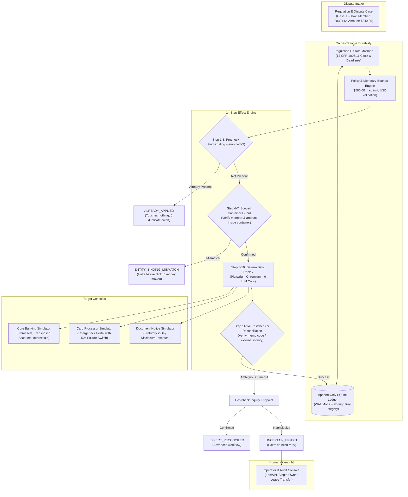

# Tandem

> **Discover once, replay safely—even when the action moves money and the outcome is uncertain.**
> Tandem turns a successful browser procedure into a guarded, deterministic capability for legacy financial systems.

[](https://github.com/jahnavinalla1/Tandem-Interface.ai/actions/workflows/ci.yml)
[](https://www.python.org/downloads/release/python-3120/)
[](https://playwright.dev/)
[](https://www.sqlite.org/wal.html)
[]()

---

## 1. The Core Problem

At hundreds of US community banks and credit unions, modern conversational AI voice and chat bots take in customer card disputes. But executing those disputes requires logging into and manipulating four disconnected vendor systems:
1. **Core Banking System** (e.g. legacy Symitar / Keystone running on iframes, tables, dynamic IDs, and 3270-style terminal emulators)
2. **Card Network Processor Portal** (e.g. Visa DPS / MasterCard chargeback settlement portals)
3. **Document / Notice Dispatch Engine** (e.g. batch letter generators for compliance disclosures)
4. **Internal Dispute Case Tracker** (e.g. spreadsheets or legacy ticketing)

None of these legacy systems expose bidirectional APIs to each other. When autonomous computer-use agents drive browser sessions across these applications, the central distributed-systems hazard is:

$$\text{\bf "The money moved. The procedure didn't finish."}$$

A browser automation may navigate the core banking console and post **$340.00** in provisional credit, then crash or suffer a network timeout before filing the chargeback or generating the mandatory 2-business-day written notice.

### The Catastrophic Costs of Naive Computer-Use Automation
- **Duplicate Provisional Credit:** Blindly restarting from step 1 re-posts credit, paying member funds twice.
- **Misdirected Funds on Confusable Entities:** Searching member `8830142` returns fuzzy hits including `8830124`. Selecting the wrong row credits the wrong account.
- **Compliance Penalties under 12 CFR 1005.11:** Regulation E mandates strict statutory deadlines:
  - **2 Business Days:** Written disclosure of provisional credit to consumer.
  - **10 Business Days:** Provision of provisional credit if investigation cannot conclude immediately.
  - **45 Calendar Days:** Maximum statutory investigation period.
- **Unsafe Retries on Ambiguous State:** A 504 Gateway Timeout on a commit submission cannot be retried without determining if the mutation landed.

---

## 2. Tandem's Architectural Solution

Tandem ensures that when browser automation acts upon financial systems, execution guarantees **effects**, not merely DOM clicks.



---

## 3. Core Architectural Invariants

### 1. Strict Zero-LLM Production Replay (`llm_call_count == 0`)
LLMs are utilized strictly for **exploratory discovery** and offline capability compilation. Once an interaction sequence is synthesized and validated into a versioned YAML capability with a SHA-256 integrity hash, production execution executes deterministically with Playwright. Every replay test asserts `llm_tracker.call_count == 0`.

### 2. The 14-Step Effect-Aware Commit Protocol
Irreversible actions (`COMMIT`) must execute the strict lifecycle:
1. **Idempotency Key Formulation:** `regE:{case_id}:provisional_credit`
2. **Precheck Inquiry:** Queries target system before actuating UI controls.
3. **Short-Circuit on Existing Effect:** If verified, returns `ALREADY_APPLIED` immediately.
4. **Monetary Bounds Validation:** Verifies amount $\le \$500.00$ limit.
5. **Container-Scoped Identity Guard:** Evaluates the immediate ancestor DOM container (e.g. `#credit_action_container`) of the submit button, verifying exact member ID and dollar balance. If fuzzy search returned the wrong row (`8830124` vs `8830142`), halts with `ENTITY_BINDING_MISMATCH`.
6. **Execution Intent Staging:** Records staged intent in the SQLite ledger.
7. **Single-Owner Lease Acquisition:** Prevents concurrent browser sessions on the same case.
8. **UI Actuation:** Dispatches click event through surface abstraction.
9. **Postcheck Verification:** Evaluates receipt container and extracts unique memo code (e.g. `MC-7621`).
10. **Reconciliation on Ambiguity:** If 504 Gateway Timeout occurs, executes postcheck inquiry. If unconfirmed, transitions to `UNCERTAIN_EFFECT` and routes to human operator without blind retry.

### 3. Append-Only Procedure Ledger with Write-Ahead Logging (WAL)
Every case initialization, capability execution, monetary state, and statutory deadline is durably committed to SQLite configured with `PRAGMA journal_mode=WAL`, `synchronous=NORMAL`, and `busy_timeout=30000`. If the process is terminated via `SIGKILL` after provisional credit posts, state is reconstructed from the ledger on restart, skipping duplicate credit and completing pending notices.

### 4. Single-Owner Lease Human Handoff
When compliance interstitials (e.g. BSA/AML holds) appear, automation yields its lease and transitions to `NEEDS_HUMAN`. An operator claims the lease, reviews the live browser session, signs off, and yields the lease back to automation to conclude the workflow.

---

## 4. How Discovery Works — What the Model Sees and Does

Discovery is the *only* place an LLM is ever called. `DiscoveryAgent.discover_provisional_credit()`
(`tandem/discovery/agent.py`) runs a bounded **observe → decide → act** loop against a
real, running instance of the hostile core banking simulator, for up to 20 cycles:

1. **Observe** (`_observe`): reads the page title, up to 12,000 characters of visible
   body text per frame, and every interactive element (`a, button, input, select,
   textarea`) with its tag, id, name, type, and visible text/value — `password` and
   `hidden` inputs are excluded before this ever leaves the browser. This becomes a
   typed `BrowserObservation`, not raw HTML dumped into a prompt.
2. **Decide**: that observation, the objective, the declared inputs (secrets
   redacted), and the last 8 prior decision/result events are sent to
   `GeminiProvider.decide()` by default, which returns exactly one structured
   `DiscoveryDecision` — never free-form text the runtime has to parse or interpret.
   A Pydantic validator rejects structurally invalid decisions before they ever reach
   the browser (e.g. a `SUBMIT` that doesn't declare `is_mutating` + a
   `container_selector` + a `guard_ref`).
3. **Act**: the agent executes exactly that one decision, takes a screenshot, and
   records everything through `TraceRecorder` before observing again.
4. Discovery ends when the model emits `FINISH`. The agent then reads the *actual*
   receipt (memo code, money-moved flag) from the live page — success is grounded in
   real page state, not the model's self-report.

**What gets saved, durably, once discovery succeeds:**
- **Per-run evidence** under `evidence/discovery/<run_id>/`: every cycle's
  observation, decision, executed action, result, and screenshot.
- **A compiled capability artifact**: `CapabilityCompiler.compile()` turns the trace's
  *executed actions* (not the model's raw reasoning) into a `CapabilityDefinition` —
  concrete Playwright steps with templated inputs (`{{input.member_id}}`), a typed
  effect spec (COMMIT/READ, idempotency key, precheck/postcheck/reconciliation), and a
  `scoped_guard` pinned to the exact container the model clicked in. The compiler
  refuses to compile if the trace's recorded actions don't match its own durable
  decision events — it can't silently drift from what actually happened. The result
  is canonicalized, SHA-256 hashed, and written to `capabilities/compiled/<id>.yaml`.
  A schema-valid, hash-verified example in this shape is checked in at
  [`capabilities/compiled/demo_post_provisional_credit.yaml`](capabilities/compiled/demo_post_provisional_credit.yaml)
  — recompiled from the successful Gemini trace in
  [evidence/20260913T161444Z](evidence/20260913T161444Z/manifest.json). Its
  `derivation` block distinguishes fields learned from the run, fields supplied by
  the approved policy profile, and compiler-generated metadata. The source run ID
  and SHA-256 bind the resulting artifact to that provenance.

Live discovery completed 9 decision cycles and 8 browser actions. New-case replay
completed with zero model calls; the injected compliance interstitial returned
`NEEDS_HUMAN` before submission. See [run status](evidence/RUN_STATUS.md).

Run another discovery with `uv run python scripts/demo.py --scenario discovery`,
or use the assignment evidence command below to compile and replay in one command.
Live discovery requires the configured discovery provider credentials.

---

## 5. How Deterministic Replay Works Without the Model in the Loop

Every other scenario replays a *compiled* capability, and the LLM is never imported,
let alone called:

- `DeterministicExecutor.execute()` (`tandem/replay/executor.py`) reads a
  `CapabilityDefinition`'s `steps` list and calls Playwright directly — `NAVIGATE`,
  `FILL`, `CLICK`, `SUBMIT` — filling in each step's input template
  (`{{input.case_id}}` → the actual case ID) with no model call anywhere in the path.
- Immediately before any `SUBMIT` step, `verify_control_scoped_guard()` re-reads the
  *exact* member/account/amount values inside the immediate container of the submit
  control — not a cached value, not the search-results row — and hard-fails the whole
  capability if they don't match what was intended.
- **How we know the model truly isn't called**, not just claimed: `llm_tracker`
  (`tandem/policy/telemetry.py`) is a single process-wide counter incremented in
  the discovery provider adapters, which the replay path never
  invokes. Every replay test explicitly asserts
  `llm_tracker.call_count == 0` after execution (see
  `tests/e2e/test_deterministic_replay.py` and every `replay-*` scenario in
  `scripts/demo.py`) — this is a checked runtime invariant on every CI run, not a
  docstring promise.
- Replaying the *same, unmodified, hash-verified* artifact against a structurally
  different UI (Institution Beta) works too, by swapping only a runtime **surface
  overlay** — proving the compiled capability generalizes without re-discovery
  (verified by `tests/integration/test_second_institution.py`).

---

## 6. Repository Structure

```
Tandem/
├── capabilities/                  # Versioned capability definitions & compiler output
│   ├── compiled/                  # Artifacts generated by DiscoveryAgent (SHA-256 hashed)
│   └── core/                      # Standard production capabilities (YAML)
├── docs/                          # Architectural specs & technical defenses
│   ├── architecture-research.md   # Ecosystem comparative research & trade-offs
│   └── product-spec.md            # Problem extraction and 8 specification scenarios
├── scripts/                       # Runnable demonstration scripts and utilities
│   ├── demo.py                    # Focused CLI runner for five assessment scenarios
│   ├── seed.py                    # Idempotent state initializer for banking simulators
│   └── start_services.py          # Unified multi-process launcher (ports 8000, 8001, 8003, 8004)
├── simulators/                    # Hostile legacy simulator applications
│   ├── core_bank/                 # Hostile Core Banking (iframes, dynamic IDs, skins)
│   ├── documents/                 # Regulation E disclosure notice dispatch portal
│   └── processor/                 # Card network chargeback portal (504 failure switches)
├── tandem/                        # Core Tandem automation library
│   ├── api/                       # Operator & Audit Console (FastAPI web app)
│   ├── discovery/                 # DiscoveryAgent, TraceRecorder, CapabilityCompiler
│   ├── domain/                    # Effect classes, Capability schemas, Outcome taxonomy
│   ├── handoff/                   # HandoffCoordinator & single-owner lease management
│   ├── ledger/                    # SQLite WAL ledger, models, repository, service
│   ├── policy/                    # Monetary bounds, scoped guards, LLM call telemetry
│   ├── replay/                    # DeterministicExecutor, EffectEngine, reconciliation
│   ├── surfaces/                  # Surface abstraction, PlaywrightSurface, overlays
│   └── workflow/                  # RegEWorkflow state machine & 12 CFR 1005.11 deadlines
├── tests/                         # Unit, integration, end-to-end, and regression suite
│   ├── e2e/                       # Zero-LLM deterministic replay & compiled artifact runs
│   ├── integration/               # Crash recovery, effect protocol, handoff, overlays, API
│   ├── regression/                # One test file per audit finding (see REMEDIATION_STATUS.md)
│   └── unit/                      # Discovery compiler, domain models, surface units
├── audit_tests/                   # 10 tests preserved from the independent adversarial audit
├── Dockerfile                     # Containerization for standalone demonstration
├── docker-compose.yml             # Orchestration for simulators and Tandem console
├── Makefile                       # Developer shortcuts (setup, test, dev, demo-*)
└── pyproject.toml                 # Project metadata and locked dependencies
```

---

## 7. Quickstart & Installation

### Prerequisites
- Python 3.12+ (a `.python-version` file pins exactly 3.12 so `uv sync` doesn't pick a
  different interpreter you happen to have installed)
- `uv` package manager ([astral.sh/uv](https://astral.sh/uv))

### Setup
```bash
# Clone the repository
git clone https://github.com/jahnavinalla1/Tandem-Interface.ai.git
cd Tandem-Interface.ai

# Create virtual environment and sync dependencies (frozen: reproducible from uv.lock,
# --extra dev: pulls in pytest/ruff/mypy so the commands below work out of the box)
uv sync --extra dev --frozen

# Install Playwright Chromium browser
uv run playwright install chromium
```

### Fast evaluator path

After setup, run the committed capability through the five required outcomes:

```bash
make verify-assignment
```

This starts the local simulators when needed, replays the hash-verified capability,
and writes a timestamped evidence bundle. It requires no provider credential and
asserts that replay makes zero model calls. A successful run prints completion,
duplicate prevention, policy denial, intervention and handoff-resume outcomes.

### Running the Test Suite
```bash
# Run all unit, integration, e2e, and regression tests
uv run pytest tests -v

# Run the preserved independent adversarial audit suite (10 tests)
uv run pytest audit_tests -v
```

> **Don't run this while `scripts/start_services.py` is already running in another
> terminal.** `tests/conftest.py` starts the simulators itself (in-process, so a
> couple of tests can flip failure switches directly on the Python objects handling
> requests); if an external `start_services.py` instance already owns those ports,
> pytest reuses it instead, and those specific tests will fail because their
> in-process state changes never reach the process actually serving the request.
> Stop any standalone services first, or just run tests in a separate terminal from a
> clean slate.

### Starting the Interactive Operator Console & Simulators
```bash
# Starts Core Bank Alpha (8001), Core Bank Beta (8002), Card Processor (8003),
# Notice System (8004), and Tandem Console (8000), all bound to 127.0.0.1 by default
uv run python scripts/start_services.py
# ...or, once installed (including from a built wheel), the equivalent console script:
uv run tandem
```
Open your browser to:
- **Tandem Operator Console:** [http://127.0.0.1:8000](http://127.0.0.1:8000)
- **Hostile Core Banking (Institution Alpha):** [http://127.0.0.1:8001](http://127.0.0.1:8001)
- **Independent Core Banking (Institution Beta):** [http://127.0.0.1:8002](http://127.0.0.1:8002)
- **Card Processor Portal:** [http://127.0.0.1:8003](http://127.0.0.1:8003)
- **Notice Disclosure Portal:** [http://127.0.0.1:8004](http://127.0.0.1:8004)

Admin/operator mutation routes (simulator resets and failure switches, lease
claim/release, browser-session actions) require the `TANDEM_ADMIN_TOKEN` bearer
token (see [SECURITY.md](SECURITY.md)); the operator console's own HTML forms embed
it automatically.

---

## 8. Assessment Demonstrations

The primary CLI stays focused on the five scenarios that establish the assignment's
central claim. Broader crash-recovery, handoff, and tenant-overlay behavior remains
covered by the automated suites.

| # | Scenario CLI Command | Description | Architectural Invariant Verified |
|---|---|---|---|
| **1** | `uv run python scripts/demo.py --scenario discovery` | LLM agent explores hostile UI and compiles capability | Synthesizes typed YAML with SHA-256 digest from a real provider-backed run |
| **2** | `uv run python scripts/demo.py --scenario replay-new-case` | Replays capability on fresh dispute case | **Strict Zero-LLM Invariant:** `llm_call_count == 0` |
| **3** | `uv run python scripts/demo.py --scenario replay-same-case` | Re-executes capability on already-credited case | Idempotency precheck returns `ALREADY_APPLIED`; 0 duplicate credit |
| **4** | `uv run python scripts/demo.py --scenario wrong-member-or-amount` | Wrong member and over-limit amount attempts | Identity and policy guards block both before COMMIT |
| **5** | `uv run python scripts/demo.py --scenario uncertain-effect` | Target commits but the response disappears | Independent reconciliation confirms or escalates; the mutation is never blindly retried |

To run all five scenarios sequentially:
```bash
uv run python scripts/demo.py --scenario all
```
The complete sequence includes a provider-backed discovery run. The deterministic
replay and verification scenarios can be run independently from the saved artifact.

---

## 9. Limitations and Design Decisions

Rather than presenting this as finished, here's what's actually true about its current
state — some by deliberate scope choice, some as known gaps.

**A successful live discovery/replay bundle is now available.**
[evidence/20260913T161444Z](evidence/20260913T161444Z/manifest.json) contains real
Gemini decisions, browser observations, screenshots, the compiled artifact and
zero-model replay results. The compiled demo artifact is generated from this run;
other curated capabilities remain fixtures. [evidence/RUN_STATUS.md](evidence/RUN_STATUS.md)
identifies the two submission evidence bundles and their hashes.

Run `make verify-assignment` for the keyless assignment demonstration. It checks
successful replay, duplicate prevention, policy denial, intervention, and same-page
handoff/resume using real lease transfers and a clearly labelled scripted operator.
Use `uv run python -m scripts.verify_assignment --manual-handoff` to operate the
headed browser yourself. Both paths use browser UI inquiries for replay checks.
The live discovery runner accepts `--manual-handoff` too.

[`CHANGE_LIST_STATUS.md`](CHANGE_LIST_STATUS.md) maps the detailed assessment
requirements to their implementation, evidence, tests, or explicit scope boundary.

Discovery and replay share destination and control admission checks, and discovery
checks the bound form before submitting. Evidence masks common sensitive fields.
Native desktop support and a general-purpose task compiler remain design proposals;
see [REPORT.md](REPORT.md) for the exact boundaries. Older effect-engine demos still
use simulator inquiry APIs; the assignment verification path does not.

**The SQLite ledger is not a "swap one config string for Postgres" story.** The
append-only enforcement that closes the audit's H-09 finding is implemented as
SQLite-specific triggers (`RAISE(ABORT, ...)`), and `tandem/ledger/database.py`
hardcodes SQLite PRAGMAs. A real multi-node deployment needs a genuine migration —
equivalent Postgres constraints/triggers, or application-level immutability — not a
connection-string change. SQLite in WAL mode was chosen deliberately for
zero-dependency crash resilience in a single-node demo, which is what this is.

**`HandoffCoordinator.operator_clear_compliance()` isn't wired to an HTTP route yet.**
It's exercised directly in Python (`scripts/demo.py`'s human-handoff scenario calls it
in-process against the same browser page automation was using), but a remote operator
console user can't yet trigger that specific action over HTTP the way lease
claim/release already can. The general brokered browser-session action API this would
route through already exists (see `AUDIT_REPORT.md`'s H-05 finding).

The Dockerfile's layer ordering is statically verified by
`tests/regression/test_build_contract.py`. CI also builds the container image so a
clean hosted runner validates the complete build rather than relying only on the
static contract test.

**Synchronous Playwright, not a distributed worker fleet.** `DeterministicExecutor`
runs one capability at a time in-process, which keeps crash-injection testing and
reasoning about execution order simple. A production deployment processing many
concurrent disputes would want a task queue dispatching headless sessions across
worker nodes — a scaling change, not a correctness one.

**M-03 (evidence/procedure abstractions) is only partially fixed.** See
`REMEDIATION_STATUS.md` — some originally-decorative abstractions have been wired into
real runtime paths; a few are still scheduled follow-up work, tracked honestly rather
than hidden.

**On the audit itself** — this isn't a project that was built and never checked. An
independent adversarial audit (`AUDIT_REPORT.md`) found this codebase scored **32/100,
verdict NOT READY** at one point: discovery was hardcoded rather than model-driven, two
workers could double-post the same credit, a guard could be bypassed by swapping a
hidden form value, the "append-only" ledger was provably mutable, and admin routes had
no authentication at all. `REMEDIATION_STATUS.md` tracks every one of those findings
through to a fix, with its own regression test and commit hash — a finding is only
marked FIXED after its test *and* the full suite *and* lint *and* type-check all pass.
That ledger is the honest record of what's actually been verified here, not a claim to
take on faith.

---

## 10. Deep-Dive Documentation Links

- [ARCHITECTURE.md](ARCHITECTURE.md): Complete breakdown of the 14-step Effect-Aware Commit Protocol, container scoping, and SQLite WAL ledger design.
- [SECURITY.md](SECURITY.md): Threat model, credential boundaries, and financial safety controls.
- [AUDIT_REPORT.md](AUDIT_REPORT.md): The independent adversarial audit that found the issues described above.
- [REMEDIATION_STATUS.md](REMEDIATION_STATUS.md): Every audit finding tracked through to a verified fix.

## Assignment submission path

See [REPORT.md](REPORT.md) for the seven required design sections and
[evidence/README.md](evidence/README.md) for evidence status and contents.
To produce a new discovery trace, configure the discovery environment in the ignored
`.env` file, then run:

```sh
.venv/bin/python -m scripts.assignment_evidence \
  --goal "Find the supplied member, post the supplied provisional credit once, and verify the receipt" \
  --target http://127.0.0.1:8001
```

This performs real discovery, compiles its actions, reloads the saved artifact,
and replays it with new inputs and zero model calls, including an injected
interstitial. Existing `demo-replay` scenarios use curated fixtures and are not
proof that a newly discovered artifact replays. Reviewers can inspect and replay the
committed discovery artifact without producing another live trace.

### Live discovery configuration

Set the provider, model, and credential in the project root `.env` file:

```dotenv
DISCOVERY_PROVIDER=gemini
DISCOVERY_MODEL=gemini-3.6-flash
GEMINI_API_KEY=your_key_here
```

Run the assignment evidence command above. The credential is used only to create a
new discovery trace and is never committed. Deterministic replay requires no provider
credential.
